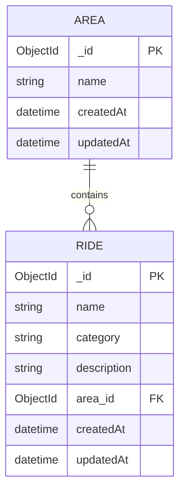

# :file_cabinet: AttractionsDatabase
All theme park attractions, one place!

:globe_with_meridians: Check out the live version: NO VERSION AVAILABLE YET

<details>
    <summary>Table of Contents</summary>
    <ol>
        <li><a href="#information_source-about-this-project">About this project</a></li>
        <li><a href="#sparkles-functionality">Functionality</a></li>
        <li>
            <a href="#rocket-getting-started">Getting started</a>
            <ol>
                <li><a href="#requirements">Requirements</a></li>
                <li><a href="#installation">Installation</a></li>
            </ol>
        </li>
        <li>
            <a href="#hammer_and_wrench-how-does-it-work">How does it work?</a>
            <ol>
                <li><a href="#technologies">Technologies</a></li>
                <li><a href="#entity-relationship-diagram">Entity Relationship Diagram</a></li>
                <li><a href="#usage">Usage</a></li>
            </ol>
        </li>
        <li><a href="#scroll-license">License</a></li>
    </ol>
</details>

[](https://github.com/semvde)


## :information_source: About this project
AttractionsDatabase is a place where theme park fans can find information on all sorts of rides from theme parks all around the world! If a ride does not exist in the database yet, it can easily be added!

This project was created for the final assignment of the course Programming 6 at Rotterdam University of Applied Sciences. The goal of the course was to build a full-stack website with React for the frond-end and Express for the back-end.


## :sparkles: Functionality
### Rides
- Find information on rides from theme parks all around the world!
- Create new rides that aren't in the database yet!
- Edit information on rides that is incorrect or outdated!
### Areas
- Find all rides based in an area from a theme park!
- Create or edit areas with new information!


## :rocket: Getting started
Below are the instructions on how to get the project running on your local machine!

### Requirements
- Node.js & NPM
- MongoDB
- (Recommended) A REST client like Postman

### Installation
1. Clone the repository
```sh
git clone https://github.com/semvde/AttractionsDatabase.git attractions-database
cd attractions-database
```
2. Setup dependencies, environment, database and front-end assets
```sh
cd react
npm install
npm run build
cd ..\express
npm install
```
- Copy and paste the following contents into a .env file (inside the express folder):
```
BASE_URI=http://localhost:8000
EXPRESS_PORT=8000

MONGO_DB_URI="mongodb://127.0.0.1:27017/rides"
```
> [!IMPORTANT]  
> Make sure [MongoDB is running](https://www.mongodb.com/docs/manual/administration/install-community/?operating-system=windows&windows-installation-method=wizard) for the database to work!

3. Setup local test server
```sh
cd react
npm run dev
cd ..\express
npm run dev
```
- View the website by going to http://localhost:5173
- View the back-end service by going to http://localhost:8000


## :hammer_and_wrench: How does it work?
Below you can find the documentation of AttractionsDatabase!

### Technologies
AttractionsDatabase uses the following technologies:
- [![React][React.com]][React-url]
    - [![Tailwind CSS][TailwindCSS.com]][TailwindCSS-url]
    - [![JavaScript][JavaScript.com]][JavaScript-url]
- [![Express][Express.com]][Express-url]
- [![MongoDB][MongoDB.com]][MongoDB-url]

### Entity Relationship Diagram
AttractionsDatabase Database logic is as follows:


### Usage
W.I.P.


## :scroll: License
The source code in this repository is licensed under the MIT License.


[React.com]: https://img.shields.io/badge/React-61DAFB?style=for-the-badge&logo=react&logoColor=black
[React-url]: https://reactjs.org
[TailwindCSS.com]: https://img.shields.io/badge/Tailwind_CSS-38B2AC?style=for-the-badge&logo=tailwind-css&logoColor=white
[TailwindCSS-url]: https://tailwindcss.com
[JavaScript.com]: https://img.shields.io/badge/JavaScript-F7DF1E?style=for-the-badge&logo=javascript&logoColor=black
[JavaScript-url]: https://developer.mozilla.org/en-US/docs/Web/JavaScript
[Express.com]: https://img.shields.io/badge/Express-000000?style=for-the-badge&logo=express&logoColor=white
[Express-url]: https://expressjs.com
[MongoDB.com]: https://img.shields.io/badge/MongoDB-47A248?style=for-the-badge&logo=mongodb&logoColor=white
[MongoDB-url]: https://www.mongodb.com
